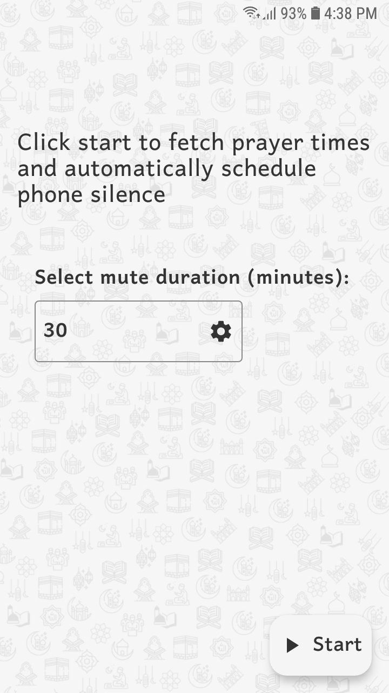
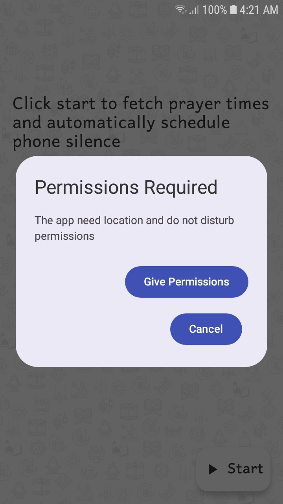
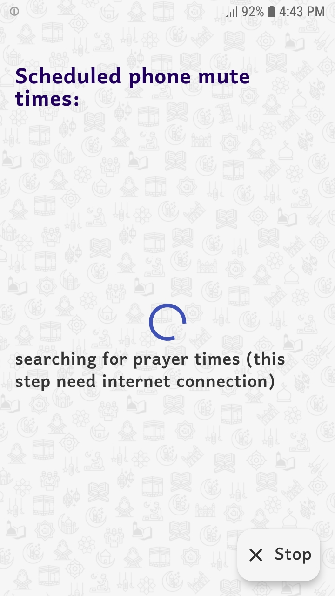
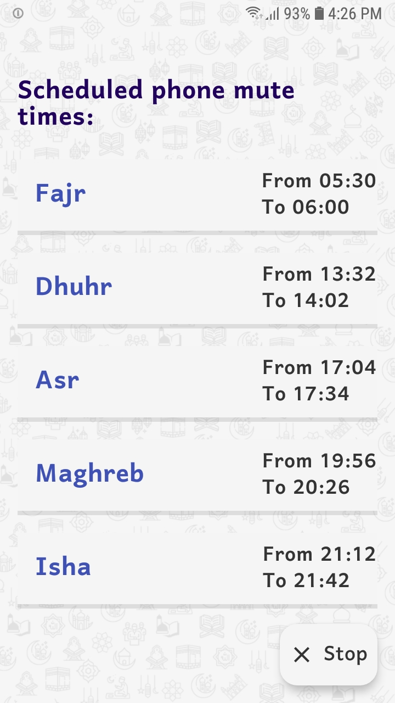
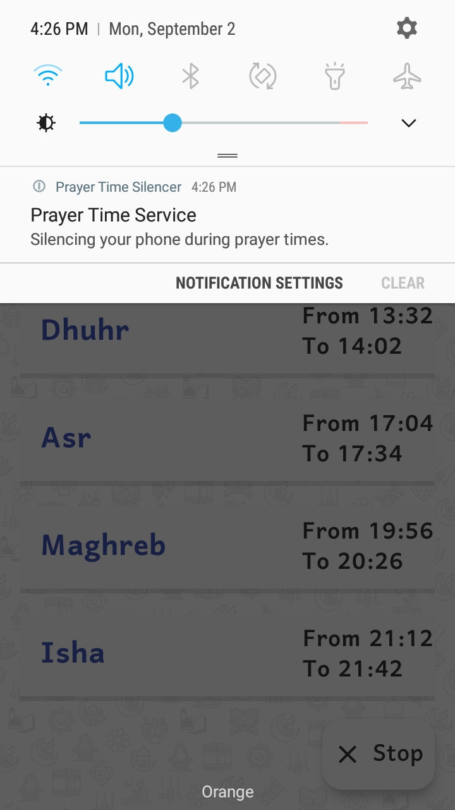
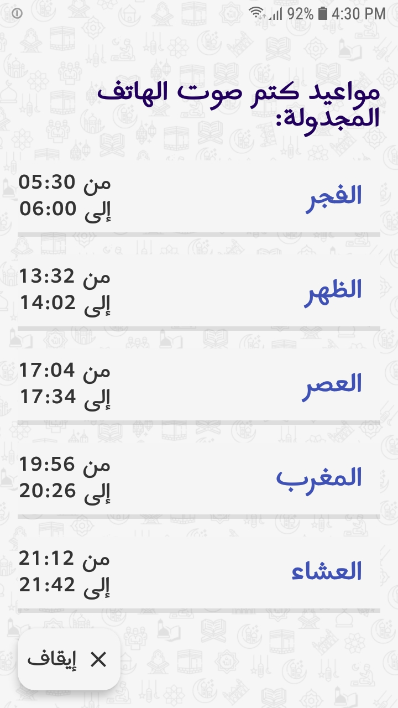

# Prayer Time Silencer

**Prayer Time Silencer** is an Android application designed to help users maintain focus during Islamic prayer times by automatically managing the phone's silence mode. The app uses the device's location to fetch daily prayer times and silences the phone during these times for a specified duration (the app only need internet connection one time a day to fetch prayer times).

## Features

- **Automatic Silence Mode:** Silences the phone during each prayer time (Fajr, Dhuhr, Asr, Maghrib, Isha) and restores the normal mode afterward.
- **Location-Based Prayer Times:** Fetches accurate prayer times based on the user's current location.
- **Foreground Service:** Runs as a foreground service to ensure it continues functioning even when closed.
- **Network Monitoring:** Monitors the network connection to ensure prayer times are fetched as soon as the internet is available (the app only need internet connection one time a day to fetch prayer times).
- **Custom Silence Duration:** Allows users to specify the duration for which the phone should remain silent during each prayer time.
- **Persistent Storage:** Stores prayer times and user preferences, ensuring functionality even after a device restart.
- **User Interface:** Displays prayer names, start and end times, and provides control to start or stop the silencing service.

## Screenshots
<div>





</div>
<div>



</div>

## Installation

To install and run the **Prayer Time Silencer** app on your local machine, follow these steps:

1. **Clone the repository:**
    ```bash
    git clone https://github.com/laktam/prayer-time-silencer.git
    cd prayer-time-silencer
    ```

2. **Open the project in Android Studio:**
   - Launch Android Studio.
   - Open the project from the cloned repository.

3. **Build and run the app:**
   - Connect your Android device or start an emulator.
   - Click on the `Run` button in Android Studio.

## Permissions Required

- **Location Permission:** To fetch accurate prayer times based on the user's current location.
- **Internet Permission:** To fetch prayer times from the API.
- **Do Not Disturb Access:** To manage the device's silence mode.

## Usage

1. **Launch the app:** Open the Prayer Time Silencer app on your Android device.
2. **Set up location and permissions:** Grant location and Do Not Disturb permissions for accurate functionality.
3. **Start the service:** The app will automatically start silencing the phone at the specified prayer times.
4. **Customize settings:** Adjust silence duration and manage other settings through the app interface.

## Technologies Used

- **Kotlin:** Programming language used for Android app development.
- **Jetpack Compose:** For building the user interface.
- **AlarmManager and Timer:** For scheduling silence actions.
- **Foreground Service:** To ensure continuous background operation.
- **SharedPreferences:** For storing user preferences and fetched prayer times.

## Todo 
- Get prayer times for a month or even a year instead of getting times for only one day to work offline
- Add update button in case of location change
- Fix app not working for somme devices
- Replace the use of forground service

## Prayer Times API used

- [IslamicFinder API](https://aladhan.com/prayer-times-api)
